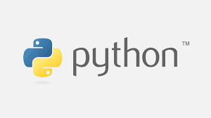

### Hi there! 
##### Welcome to my github profile! It might seem a bit empty now, but i'll be working on filling it up soon 😄!

# Langages I know 

        

            
        

           

            
        

        

            
        

      

            
         

    

# What I'm learning 🌱
Back - end engineering, data science, Machine Learning

<!--
**adi-bal/adi-bal** is a ✨ _special_ ✨ repository because its `README.md` (this file) appears on your GitHub profile.

Here are some ideas to get you started:

- 🔭 I’m currently working on ...
- 🌱 I’m currently learning ...
- 👯 I’m looking to collaborate on ...
- 🤔 I’m looking for help with ...
- 💬 Ask me about ...
- 📫 How to reach me: ...
- 😄 Pronouns: ...
- ⚡ Fun fact: ...
-->
